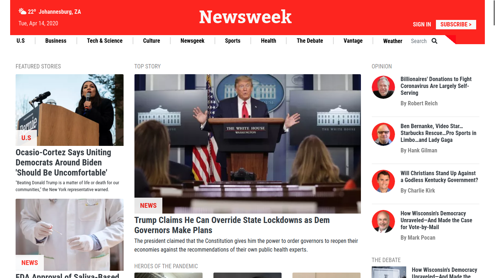

# Newsweek Clone

> This is a clone of the newsweek homepage that is written using Bootstrap. This showcases the Bootstrap abilities and forms part of the projects in the Microverse curriculum.

This project includes the following:

1. Responsive design using Bootstrap
2. Flex, Bootstrap Grid and Positioning used
3. Clone of newsweek.com homepage

## Built With

- HTML & CSS
- Bootstrap
- Font Awesome Icons

## Live Demo

[Live Demo Link](https://azeem838.github.io/newsweek-clone/)

👤 **Azeem Ahmed**

- Github: [@Azeem838](https://github.com/Azeem838)
- LinkedIn: [Azeem Ahmed](https://www.linkedin.com/in/azeem-ahmed-a56a25101/)

## 🤝 Contributing

Contributions, issues and feature requests are welcome!

Feel free to check the [issues page](https://github.com/Azeem838/newsweek-clone/issues).

## Show your support

Give a ⭐️ if you like this project!

## 📝 License

This project is [MIT](lic.url) licensed.
